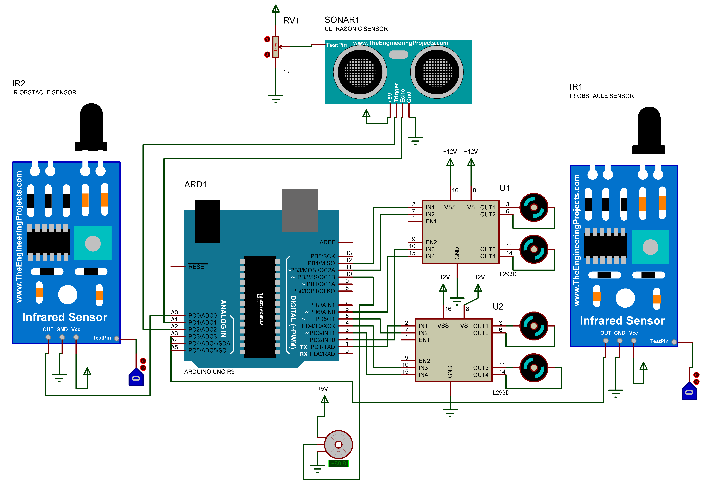

# Human Following Robot using Arduino

This project implements a *Human Following Robot using Arduino*. The robot is equipped with sensors that allow it to detect objects, particularly humans, and follow their movements. It utilizes an ultrasonic sensor and IR sensors to track the position of the human and adjust its movement accordingly.

## Introduction

The Human Following Robot is a project aimed at creating an autonomous robot that can navigate its environment by following humans. It is based on the Arduino platform and uses a combination of sensors and motors to achieve its functionality.

## Hardware Components

- Arduino board
- Ultrasonic sensor
- Infrared (IR) sensors
- Servo motor
- DC motors (4)

## Software Libraries

This project utilizes the following Arduino libraries:
- [NewPing](https://github.com/microflo/NewPing): Library for the ultrasonic sensor.
- [Servo](https://www.arduino.cc/en/reference/servo): Library for controlling the servo motor.
- [AFMotor](https://github.com/adafruit/Adafruit-Motor-Shield-library): Library for controlling the DC motors.

## Setup Instructions

1. Install the necessary Arduino libraries:
   - NewPing
   - Servo
   - AFMotor

2. Connect the hardware components according to the wiring diagram.

4. Upload the provided Arduino sketch to your Arduino board.

## Usage

Once the sketch is uploaded and the hardware is properly connected, the robot should be able to detect and follow humans within its vicinity. Here's how to use it:

1. Power on the robot.

2. Place it in an environment with enough space to move around and with humans nearby.

3. The robot should start following the nearest human detected by its sensors.

4. Monitor the serial output for debugging information and sensor readings.

## Contributing

Contributions to improve this project are welcome! You can contribute by:
- Reporting bugs or suggesting enhancements by creating issues.
- Forking the repository and submitting pull requests with your changes.
